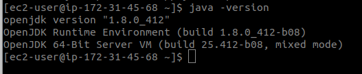
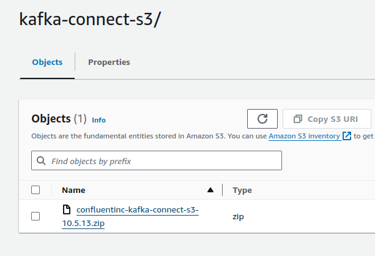
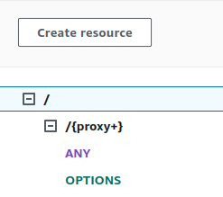
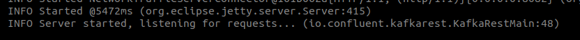
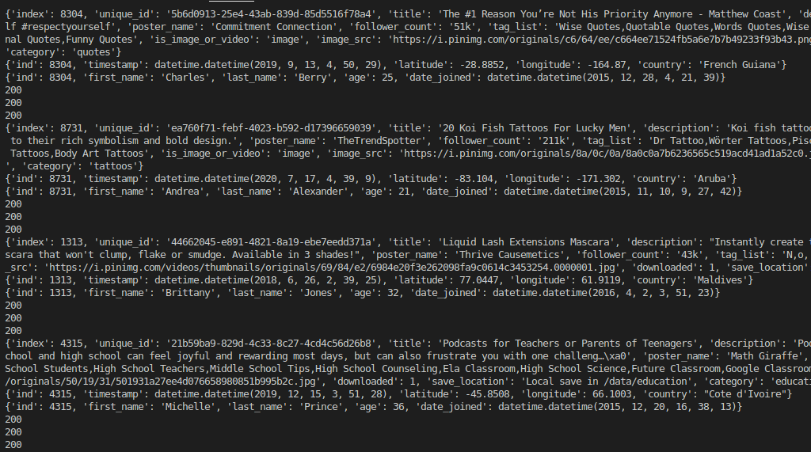
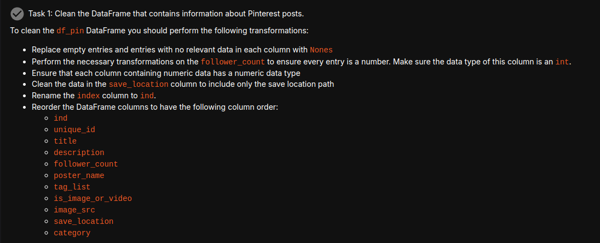
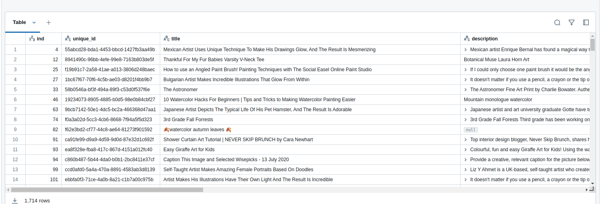
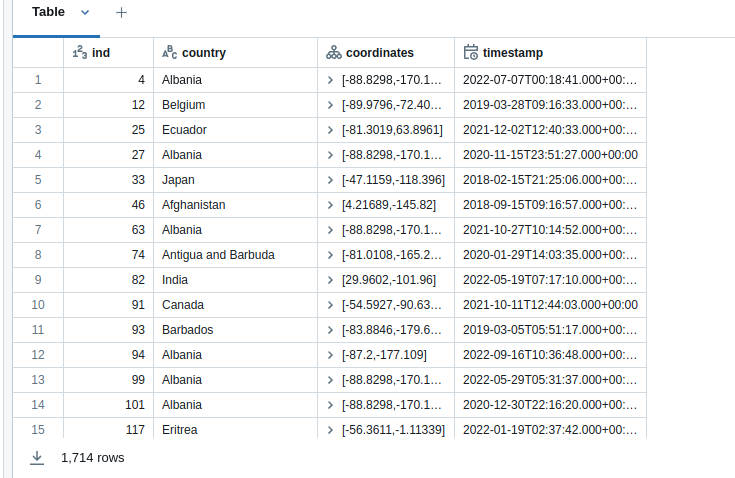
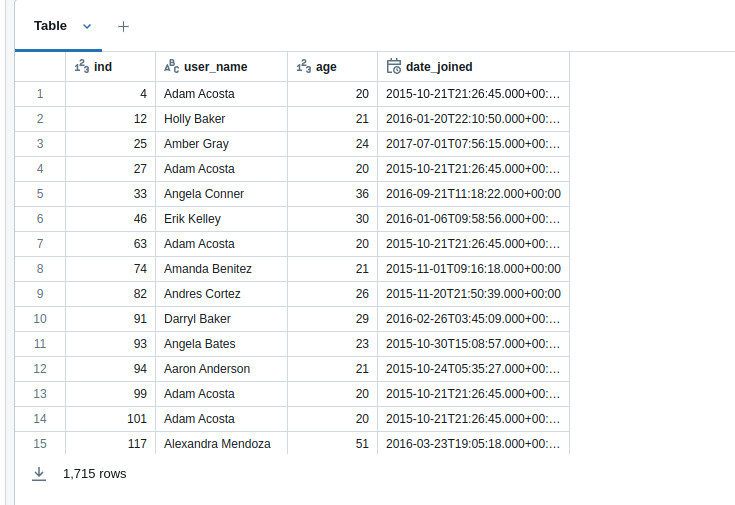

# PINTREST DATA PIPELINE

Pinterest crunches billions of data points every day to decide how to provide more value to their users.

## Description:

The aim of this project is to gain a better understanding of Data Engineering workflows and the Extract Transform Load pipeline, by replicating the Pintrest Data Pipeline, supported by AWS Cloud services.

This README documents the journey of data through this pipeline, from the initial ingestion of raw data, to the final writing to Delta Lake tables.

TODO: consider Toc

## Setup and Installation:

Firstly, clone this repo, and move the working directory inside with the following terminal commands:

```
$ git clone https://github.com/ArachnaDude/pinterest-data-pipeline7.git
$ cd pinterest-data-pipeline7
```

N.B. While the `requirements.txt` file has been provided to manage the Python packages in the project, the system-level, and external dependencies are present in `environment.yaml`.

Set up the Conda environment by running the following terminal commands:

```
$ conda env create -f environment.yaml
$ conda activate pinterest_pipeline
```

Alternatively:

```
$ conda create --name pinterest_pipeline python=3.8
$ conda activate pinterest_pipeline
$ pip install -r requirements.txt
```

Note, we are explicitly specifying Python v3.8 to ensure compatability with some of the packages used in the project.

## Milestone 1:

Milestone 1 consists of creating the GitHub repository for the project and receiving the login credentials for the provided AWS account.

## Milestone 2:

The foundational file the project requires is `user_posting_emulation.py`. When run, this file simulates the JSON data received by Pinterest's API after a user makes a `POST` request to upload data. It does this by pulling a pseudo-random list of dicts from tables contained in a RDS database.

This data is in three parts:

- <b>pinterest_data:</b> data about the Pinterest post.
- <b>geolocation_data:</b> geolocation data of the corresponding Pinterest post.
- <b>user_data:</b> user data of the corresponding Pinterest post.


Initially, this file contained credentials for the RDS database, which were abstracted out to a separate `db_creds.yaml` file, which was subsequently added to the `.gitignore` file to prevent these credentials being leaked.

## Milestone 3:

### key-pair.pem:

As the project requires running an AWS EC2 instance, establishing a secure connection from our local machine to the Cloud instance is required. We are provided with a `KeyPairId` in the AWS setup in Milestone 1, and we can use this to locate and copy the key-pair for connecting to the already configured EC2 instance.

We create a `.pem` file locally, and add the copied key-pair.
It is important at this point to make sure the working directory is pointing to the directory the `.pem` file is saved in, and run the following command:

```
$ chmod 400 <key-pair-id>.pem
```

Substituting in the name used to save the key-pair.

The purpose of this is to change the permissions associated with the file, so _only_ the owner of the file can read it, and preventing anyone, including the owner, from writing to it or executing it.

We are now ready to connect to our EC2 instance.

### EC2 instance connection:

The command to connect via SSH to the EC2 must be assembled from the path to the private key, and the public DNS for the EC2 instance. It should follow this basic structure:

```
$ ssh -i "</path/to/.pem/>" ec2-user@<public_dns_name>
```

On successful connection, you will be greeted with a pleasing graphic:


### Kafka installation and setup:

The next step is to install and configure Apache Kafka on our EC2 instance.

N.B. Be aware that this step is rather configuration-heavy. As each step builds on multiple others that come before it, errors can be difficult to recognise and to resolve.

Apache Kafka is written in Java, and so to run successfully requires the installation of the Java Runtime Environment (JRE). The Amazon Linux distribution uses the `yum` package manager, instead of `apt` that distributions like Unbuntu or Debian typically use. With this in mind, the following command will install Java 8 to the EC2 instance:

```
$ sudo yum install java-1.8.0-openjdk
```

After this completes, we can verify the installation with:

```
$ java -version
```



We now need to download and install Apache Kafka to our EC2. We do this by running the following commands:

```
$ wget https://archive.apache.org/dist/kafka/2.8.1/kafka_2.12-2.8.1.tgz
$ tar -xzf kafka_2.12-2.8.1.tgz
```

N.B.

- `wget` is a command-line utility for downloading files for the web. We're dowloading a tarball file that contains the 2.8.1 version of Kafka, compiled for Scala 2.12.

- `tar` is the command-line utility for creating and/or extracting compressed files or archives. The flags we are using, `-x`, `-z` and `-f` tell the utility respectively to extract the files, that we want to extract them using gzip, and finally the filepath to the file.

Once this is complete, running the `ls` command will show a Kafka directory inside the root directory of the EC2. The next step is to allow this EC2 to connect with MSK clusters that require IAM authorisation.

Move inside the Kafka installation directory, and the `libs` subdirectory with the command:

```
$ cd kafka_2.12-2.8.1/libs
```

This is where we need to install the IAM MSK authentication package. Do so with:

```
$ wget https://github.com/aws/aws-msk-iam-auth/releases/download/v1.1.5/aws-msk-iam-auth-1.1.5-all.jar
```

This `.jar` file will provide the Kafka client with the necessary authentications to connect to MSK clusters. As such, it's important that we save the location of this file to an environment variable, `CLASSPATH`.

This will keep the environment variable persistant between sessions, otherwise it would be lost next time we connect to the EC2 instance.

Open the `.bashrc` file with:

```
$ nano ~/.bashrc
```

and add this line to the bottom of the file:

```
export CLASSPATH=/home/ec2-user/kafka_2.12-2.8.1/libs/aws-msk-iam-auth-1.1.5-all.jar
```

Save and close `.bashrc`, and apply the changes with:

```
source ~/.bashrc
```

We can test this works with the command:

```
$ echo $CLASSPATH
```

This should display the absolute path to the `.jar` file, and should continue to do so every time you connect to the EC2 in a new terminal session.

The next step in our configuration is to setup the Kafka client to use IAM for authentication.

We do this by creating a configuration file for the client to use.

Change the working directory to the `bin` folder (assuming the working directory is still ~/kafka_2.12-2.8.1)

```
$ cd ..
$ cd bin/
```

Create a client.properties file, and add the following configurations:

```
security.protocol = SASL_SSL
sasl.mechanism = AWS_MSK_IAM
sasl.jaas.config = software.amazon.msk.auth.iam.IAMLoginModule required awsRoleArn="<Your Access Role>";
sasl.client.callback.handler.class = software.amazon.msk.auth.iam.IAMClientCallbackHandler
```

The awsRoleArn to be used here is located in the IAM console under the format "<user_id>-ec2-access-role".

### Creating Topics:

We must now create topics for each of the three categories of data we will be dealing with.

To do this we need to retrieve the Bootstrap servers string and the Plaintext Apache Zookeeper connection string, which can be found in the MSK Management Console for the cluster.

The following topics are to be created:

- <user_id>.pin
- <user_id>.geo
- <user_id>.user

from the `bin/` folder in the Kafka installation directory, run the following command:

```
./kafka-topics.sh --bootstrap-server <Bootstrap_Server_String> --command-config client.properties --create --topic <topic_name>
```

Run this command for each of the topics to create. It may be easier to assemble this command in a .txt file, given the substitutions required.

## Milestone 4:

With the topics successfully created, we now must connect an S3 bucket for the EC2 to write out data to, making it a sink. We do this with the `confluent.io Amazon S3 Connector`. Change the working directory back to the root folder, and run the following commands:

```
$ sudo -u ec2-user -i
$ mkdir kafka-connect-s3 && cd kafka-connect-s3
$ wget https://d2p6pa21dvn84.cloudfront.net/api/plugins/confluentinc/kafka-connect-s3/versions/10.5.13/confluentinc-kafka-connect-s3-10.5.13.zip
$ aws s3 cp ./confluentinc-kafka-connect-s3-10.0.3.zip s3://<BUCKET_NAME>/kafka-connect-s3/
```

These instructions will, respectively:

- assume administrator priviledges on the EC2 instance
- create and move working directory into the directory to save the connector
- download the connector from Confluent
- copy the connector to the S3 bucket.

If we check our S3 bucket, we can see there has been a folder created with our `.zip` file in it.



We can now create the custom plugin in the MSK console using this file, and configure it in the Cluster List.

On successful configuration, data that passes through the cluster will be written to the S3 bucket!

## Milestone 5:

### Kafka REST proxy integrations for API:

An AWS API Gateway resource has been provided for use in the project, however it requires a `{proxy+}` integration setting up. We do this by creating a child resource and naming it `{proxy+}`. We set up an `ANY` method, and set the `Endpoint URL` to the `public DNS` of our EC2 instance.



On deployment, we receive an `invoke URL`, which we will require later on.

## Setting up Kafka REST proxy on the EC2:

In order for our MSK cluster to consume the data we will send to the API, we need to set up and configure the Kafka REST proxy on our EC2 instance.

Connect to the EC2 instance and run the following commands:

```
$ sudo wget https://packages.confluent.io/archive/7.2/confluent-7.2.0.tar.gz
$ tar -xvzf confluent-7.2.0.tar.gz
```

This will download and install the Confluent REST proxy package to the EC2. To allow communication with the MSK cluster, and to set up IAM authentication, navigate to the `/kafka-rest` directory, and modify the kafka-rest.properties file.

```
$ cd confluent-7.2.0/etc/kafka-rest
$ nano kafka-rest.properties
```

The `bootstrap.servers` and `zookeeper.connect` varibles need to be updated with our `Bootstrap Server String`, and `Plaintext Apache Zookeeper connection string` that we obtained earlier (and should have made a note of!).

Additionally, we need to add the following code to the end of the file to allow authentication via IAM (using that IAM MSK authentication package we downloaded previously).

```
client.security.protocol = SASL_SSL
client.sasl.mechanism = AWS_MSK_IAM
client.sasl.jaas.config = software.amazon.msk.auth.iam.IAMLoginModule required awsRoleArn="<Your Access Role>";
client.sasl.client.callback.handler.class = software.amazon.msk.auth.iam.IAMClientCallbackHandler
```

Again, the awsRoleArn must be substituted with the one we previously obtained.

Save and close the file.

### Listening:

We can now start the REST proxy on our EC2 instance.

To do this, we must be in the correct directory, `~/confluent-7.2.0/bin`, and run the following command:

```
$ ./kafka-rest-start /home/ec2-user/confluent-7.2.0/etc/kafka-rest/kafka-rest.properties
```

When this command is run, the screen will very quickly fill with text. However the most important part is the very last line, which will (if all went correctly) say:

```
INFO Server started, listening for requests
```

Much like this:



We now head back to our python file, `user_posting_emulation.py`, and start it running.
If printed out, the `response.status_code` should be 200, meaning all is well!


The printed data should look like this:



And if we check out our S3 bucket, we can see that the data is being written to freshly created topic folders.

Leave this running for as long as you consider necessary, then cancel it with `ctrl + c`.

## Milestone 6

With the sending of the data nicely in hand, we can turn our attention to processing it in Databricks.

The first thing we need to do is mount our S3 bucket to Databricks so it can be utilised as an external resource.

This is done by creating a new notebook, and adding the following to a cell:

```
from pyspark.sql.functions import *
import urllib

delta_table_path = "dbfs:/user/hive/warehouse/authentication_credentials"

aws_keys_df = spark.read.format("delta").load(delta_table_path)

ACCESS_KEY = aws_keys_df.select('Access key ID').collect()[0]['Access key ID']
SECRET_KEY = aws_keys_df.select('Secret access key').collect()[0]['Secret access key']
ENCODED_SECRET_KEY = urllib.parse.quote(string=SECRET_KEY, safe="")


AWS_S3_BUCKET = "bucket_name"
MOUNT_NAME = "/mnt/mount_name"
SOURCE_URL = "s3n://{0}:{1}@{2}".format(ACCESS_KEY, ENCODED_SECRET_KEY, AWS_S3_BUCKET)
dbutils.fs.mount(SOURCE_URL, MOUNT_NAME)
```

These commands will, respectively:

- import pyspark and url processing functionality
- define the path, and subsequently read the authentication credentials to, a Spark dataframe
- obtain the AWS access and secret keys from the Dataframe, and encode the secret key
- define the S3 bucket name, the mount name and source url, and finally mount the drive to the file system.

This is persistent, so only needs to be performed once, unless the cluster is reset or other similarly destructive actions are performed.

## Milestone 7

We can now batch process the data that has been written to the bucket.

Spark gives us the ability to mass-add an entire folder of files to a Dataframe. We do this by adding this code to a cell and running it:

```
file_location = "</mnt/mount_name/filepath_to_data_objects>/*.json"
file_type = "json"
infer_schema = "true"
df = spark.read.format(file_type) \
.option("inferSchema", infer_schema) \
.load(file_location)
display(df)
```

This code will read every file in the S3 bucket with a .json file extension, and colate it into a single dataframe, and finally display it.

We can then proceed with cleaning the dataframes.



Using the functionality of pyspark, this is achievable in a similar way to how we would use Pandas. The functionality does differ in several key ways, such as no way of isolating the index of a particular result. There is more than a dash of SQL functionality in of writing the queries to target the rows and values we want.

However, like with Pandas, we do re-assign the dataframe to itself with the updated data.

This is the code that will replace specific targeted values with `None`, or the `Null` datatype.

```
df_pin = df_pin.withColumn("description", when(col("description").rlike("(No description available|Untitled)"), None).otherwise(col("description")))
df_pin = df_pin.withColumn("follower_count", when(col("follower_count").rlike("User Info Error"), None).otherwise(col("follower_count")))
df_pin = df_pin.withColumn("image_src", when(col("image_src").rlike("Image src error."), None).otherwise(col("image_src")))
df_pin = df_pin.withColumn("poster_name", when(col("poster_name").rlike("User Info Error"), None).otherwise(col("poster_name")))
df_pin = df_pin.withColumn("tag_list", when(col("tag_list").rlike("N,o, ,T,a,g,s, ,A,v,a,i,l,a,b,l,e"), None).otherwise(col("tag_list")))
df_pin = df_pin.withColumn("title", when(col("title").rlike("(^$|No Title Data Available)"), None).otherwise(col("title")))
```

While it is possible to chain together queries, it can get confusing quickly, and become more difficult to debug if there are issues.

The cleaned dataframe will have a similar appearance to this:



In addition to the clean mandated by the task, additional steps were taken, which included converting the `downloaded` column to a boolean value, and splitting the `tags` column into an column that contains arrays of strings.

The other two dataframes were similarly cleaned, with the results looking like this:

def_geo:


df_user:


The questions that were posed subsequently are all answered.

For the questions in tasks 4-11, please find the context for the qestions and the code that generates the successful answers at the end of the `dataframes_and_cleans` file in the repo.

## Milestone 8
