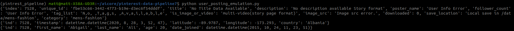
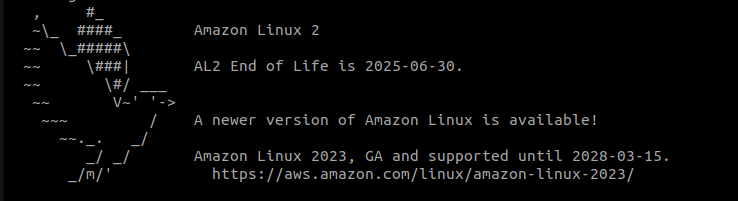

# PINTREST DATA PIPELINE

Pinterest crunches billions of data points every day to decide how to provide more value to their users.

## Description:

The aim of this project is to gain a better understanding of Data Engineering workflows and the Extract Transform Load pipeline, by replicating the Pintrest Data Pipeline, supported by AWS Cloud services.

This README documents the journey of data through this pipeline, from the initial ingestion of raw data, to the final writing to Delta Lake tables.

TODO: consider Toc

## Setup and Installation:

Firstly, clone this repo, and move the working directory inside with the following terminal commands:

```
$ git clone https://github.com/ArachnaDude/pinterest-data-pipeline7.git
$ cd pinterest-data-pipeline7
```

N.B. While the `requirements.txt` file has been provided to manage the Python packages in the project, the system-level, and external dependencies are present in `environment.yaml`.

Set up the Conda environment by running the following terminal commands:

```
$ conda env create -f environment.yaml
$ conda activate pinterest_pipeline
```

Alternatively:

```
$ conda create --name pinterest_pipeline python=3.8
$ conda activate pinterest_pipeline
$ pip install -r requirements.txt
```

Note, we are explicitly specifying Python v3.8 to ensure compatability with some of the packages used in the project.

## Milestone 1:

Milestone 1 consists of creating the GitHub repository for the project and receiving the login credentials for the provided AWS account.

## Milestone 2:

The foundational file the project requires is `user_posting_emulation.py`. When run, this file simulates the JSON data received by Pinterest's API after a user makes a `POST` request to upload data. It does this by pulling a pseudo-random list of dicts from tables contained in a RDS database.

This data is in three parts:

- <b>pinterest_data:</b> data about the Pinterest post.
- <b>geolocation_data:</b> geolocation data of the corresponding Pinterest post.
- <b>user_data:</b> user data of the corresponding Pinterest post.



Initially, this file contained credentials for the RDS database, which were abstracted out to a separate `db_creds.yaml` file, which was subsequently added to the `.gitignore` file to prevent these credentials being leaked.

## Milestone 3:

### key-pair.pem:

As the project requires running an AWS EC2 instance, establishing a secure connection from our local machine to the Cloud instance is required. We are provided with a `KeyPairId` in the AWS setup in Milestone 1, and we can use this to locate and copy the key-pair for connecting to the already configured EC2 instance.

We create a `.pem` file locally, and add the copied key-pair.
It is important at this point to make sure the working directory is pointing to the directory the `.pem` file is saved in, and run the following command:

```
$chmod 400 <key-pair-id>.pem
```

Substituting in the name used to save the key-pair.

The purpose of this is to change the permissions associated with the file, so _only_ the owner of the file can read it, and preventing anyone, including the owner, from writing to it or executing it.

We are now ready to connect to our EC2 instance.

### EC2 instance connection:

The command to connect via SSH to the EC2 must be assembled from the path to the private key, and the public DNS for the EC2 instance. It should follow this basic structure:

```
$ ssh -i "</path/to/.pem/>" ec2-user@<public_dns_name>
```

On successful connection, you will be greeted with a pleasing graphic:



### Kafka installation:
